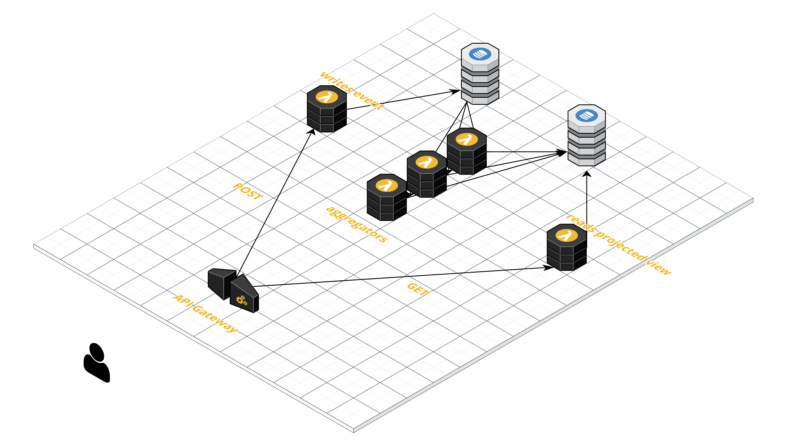

# Simple ES API

The Simple ES API is a AWS Serverless-based API for a basic Event Sourced data model. 

## Design



This is not a RESTful service, but is close to it, modified for a more Event Sourced style data model. Creating, updating, and reading a data object to and from the API works in this sequence:

1. The API Gateway endpoint is hit with a POST at `/` and the body following this schema:
```
{
    "eventId": string,
    "type": string,
    ... (additional fields)
}
```
2. The Lambda takes the body data and writes a new record to the DynamoDB `events` table.
3. The record is passed, via stream, to another Lambda that processes that event and updates a record in a second DynamoDB table. This is the projected view of the stream. You get one by default, but you can add additional later.
4. Later, a user requests the model, API Gateway then calls a lambda that reads the projected view from the table and returns it to the user. This one lambda can handle reading any of the projected views.

All creation and update transactions occur by creating new Events in the system. No direct CRUD is available. 

Reading records can either done by `id`, or by all, just like a standard REST GET. When reading all, pages are limited to 10 records. The DynamoDB LastEvaluatedKey key is returned on the header and is expected to be passed as the ExclusiveStartKey on the GET header.

## Design Considerations

Originally I wanted to have API Gateway hit the DynamoDB's directly. However, doing so introduced a few things I didn't like:

1. Mapping the POST request body to the DynamoDB record was done inside the APIStack class using the API Gateway Mapping Template language which I wasn't overly fond of.
2. The mapping didn't provide a flexible enough mechanism for validating requests.
3. Too much onus and trust was on the client.

I didn't feel the reduced complexity and costs were worth the tradeoffs, so I'm using Lambdas. However, I would consider making it an option if there was community desire for it.

Additionally, you'll notice there is no authentication. While Cognito support is likely coming, working an authentication opinion into this architecture feels wrong. However, that's not to say you shouldn't be using authentication. But it'll be on you to work that into the architecture appropriately. Again, if there is community desire for a specific approch, I'll do my best to support it. 

## Issues

Don't like my naming of things? Something doesn't work? Have a suggestion? Open an [Issue](issues).

## Pre-req's

This API makes uses of the [AWS CDK](https://docs.aws.amazon.com/cdk/api/latest/) for the building of the infrastructure components. Make sure you have your AWS CLI and AWS CDK CLI installed and properly configured.

The CICD CDK, application CDK, and lambdas, are all written in Typescript. 

## Getting Started

Start by cloning or forking this repo.

It's best to start by installing and verifying the original package before you start modifying it for your own needs:

```
cd api
cdk deploy 
```

With this, you should get a basic API according to the diagram.

## CICD

This package also comes with a secondary CDK module that will setup a CICD pipeline for this API. Follow the instructions in the [related README](cicd/README.md)

## License (MIT)

Copyright (c) 2019 Matthew Bonig

Permission is hereby granted, free of charge, to any person obtaining a copy
of this software and associated documentation files (the "Software"), to deal
in the Software without restriction, including without limitation the rights
to use, copy, modify, merge, publish, distribute, sublicense, and/or sell
copies of the Software, and to permit persons to whom the Software is
furnished to do so, subject to the following conditions:

The above copyright notice and this permission notice shall be included in all
copies or substantial portions of the Software.

THE SOFTWARE IS PROVIDED "AS IS", WITHOUT WARRANTY OF ANY KIND, EXPRESS OR
IMPLIED, INCLUDING BUT NOT LIMITED TO THE WARRANTIES OF MERCHANTABILITY,
FITNESS FOR A PARTICULAR PURPOSE AND NONINFRINGEMENT. IN NO EVENT SHALL THE
AUTHORS OR COPYRIGHT HOLDERS BE LIABLE FOR ANY CLAIM, DAMAGES OR OTHER
LIABILITY, WHETHER IN AN ACTION OF CONTRACT, TORT OR OTHERWISE, ARISING FROM,
OUT OF OR IN CONNECTION WITH THE SOFTWARE OR THE USE OR OTHER DEALINGS IN THE
SOFTWARE.